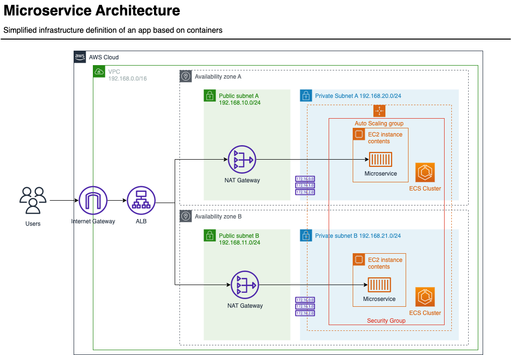

# AWS Microservices Architecture

This project tries to illustrate a very simple and basic microservice infrastructure deployed in AWS. The idea behind it, is to make a brief comparison between two Infrastructure as Code (**IaC**) tools: **Cloudformation** VS **Terraform**.

## Architecture Overview

The following diagram shows the interaction among the AWS services that conforms the whole architecture. It is a high-level abstraction of the most common pattern used nowadays in production environments. All resources are provisioned using templates so that the infrastructure is reusable and self-documented. This makes the maintainance and deployments easier than ever before.

